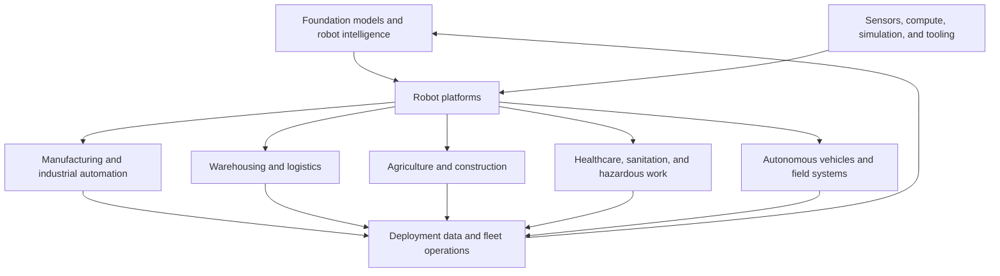

# Physical AI Business Index

Last updated: 2026-08-07

This is a maintained company-intelligence index for understanding who is turning perception, autonomy, learned control, and robotics into products. It starts with focused US and India datasets:

- [US Physical AI companies](./us-physical-ai-companies.csv)
- [India Physical AI companies](./india-physical-ai-companies.csv)

It is not an investment recommendation, a complete market map, or a ranking. Private-company financing data is incomplete by nature.

## Market architecture

## Categories

| Category | What is sold | Typical buyer | Important business questions |
|---|---|---|---|
| Robot foundation models | General or cross-embodiment policies, APIs, licensing | robot OEMs and large deployers | access to data, generalization evidence, inference cost, hardware partnerships |
| Humanoid/general-purpose robots | integrated body, autonomy, fleet software, services | manufacturing, logistics, eventually services | reliability, useful task hours, unit economics, safety, production capacity |
| Industrial manipulation | flexible picking, assembly, loading, machine tending | factories, warehouses, parcel networks | cycle time, changeover time, supported objects, integration and service burden |
| Autonomous mobile robots | material movement and fleet orchestration | factories, warehouses, construction | deployment time, navigation robustness, throughput, fleet utilization |
| Vertical field robotics | task-specific autonomous machines | agriculture, sanitation, energy, construction, defense | environment variability, regulatory constraints, outcome-based ROI |
| Enabling infrastructure | simulation, sensors, compute, observability, data | developers and OEMs | platform dependency, attach rate, recurring software revenue, ecosystem control |

## Geography rule

- **US index:** company is headquartered or operationally based in the United States.
- **India index:** company was founded and remains headquartered or operationally rooted in India. Global subsidiaries do not remove it from the India index.
- Indian-founded companies that later establish a foreign headquarters can eventually appear in a separate diaspora/cross-border view; they are not duplicated without an explicit reason.

## Financial-data rules

1. Store the amount and currency stated by the source; do not silently convert currencies.
2. `latest_disclosed_financing` is one announced transaction, not the company's total funding.
3. `cumulative_disclosed_funding` is `UNKNOWN` unless a source states it or the row clearly labels a calculated minimum from named rounds.
4. Valuation types are not interchangeable:
   - `POST_MONEY`: equity value after a financing.
   - `PRE_MONEY`: equity value before new money.
   - `TRANSACTION_VALUE`: value implied by an acquisition/SPAC transaction and possibly not yet closed.
   - `REPORTED`: credible reporting where the company did not disclose the number itself.
5. A valuation is never estimated from funding unless a transaction explicitly discloses stake percentage and the calculation is labeled.
6. Announced but unclosed transactions are marked in `company_status`; deal status is separate from whether a disclosed figure is pre-money, post-money, or transaction value.
7. Rumored rounds are excluded from the main financial fields and may be noted separately.

## Evidence and confidence

- `HIGH`: product facts from the company and financial facts from a company announcement, regulatory filing, or directly attributable transaction announcement.
- `MEDIUM`: product facts are primary; financing or valuation is from Reuters, AP, Bloomberg, TechCrunch, Economic Times, a government/industry report, or a mature funding database.
- `LOW`: incomplete or conflicting data; row is useful for discovery but needs another source before financial comparison.

Every row includes `last_verified`. Fast-moving companies and open financing events should be rechecked monthly; the full list should be reviewed quarterly.

## What to add next

- Public enabling companies and business units: NVIDIA, Tesla, Amazon Robotics, Alphabet/DeepMind, Hyundai/Boston Dynamics, and major industrial automation vendors.
- Revenue, deployment counts, and named customers where the evidence is reliable.
- A deal history table separate from the company snapshot, so older rounds are not overwritten.
- India/US cross-border expansion, manufacturing capacity, and government procurement.
- Failure/status tracking for acquisitions, shutdowns, restructurings, and announced transactions that do not close.
